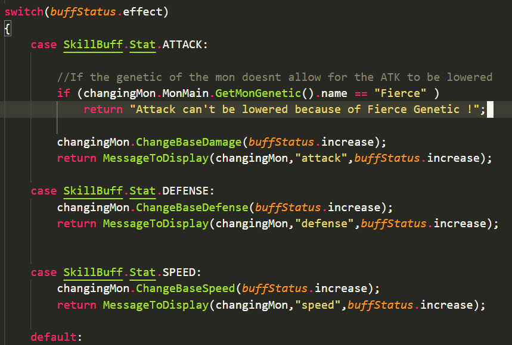
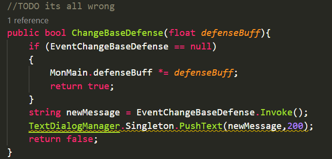

# Code Design Decision

Implementing a passive hability to a pokemon takes a lot of refactoring of the current code.

One **cheap** and **easy** way to do it would be a simple `if statement` where we would check if the pokemon has a certain genetic.

We just check if has the ***Genetic Fierce***, and handle the corresponding behaviour.

This architecture is going to be very messy really quick...

---------

It might be better to use `events`.
If the is a event registed to the function then apply first the methods register.

But the way it is structured it would require so much more work to implement.

So I decided to go for the easy way for now :)